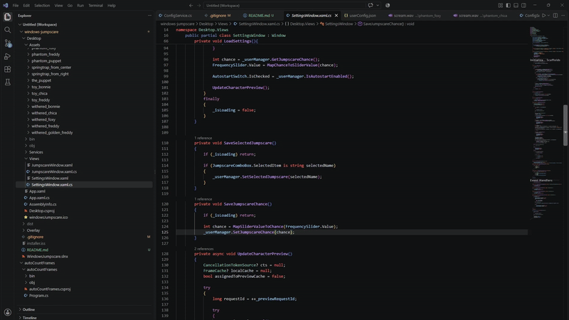

# Windows Jumpscare

<p align="center">
  
</p>

<p align="center">
  <strong>A stealthy, lightweight background prank utility for Windows that triggers nostalgic, full-screen horror jumpscares at randomized intervals.</strong>
</p>

<p align="center">
  <a href="https://dotnet.microsoft.com/download/dotnet/10.0"></a>
  <a href="https://learn.microsoft.com/en-us/dotnet/desktop/wpf/"></a>
  <a href="https://jrsoftware.org/isinfo.php"></a>
  <a href="https://github.com/yakimi27/windows-jumpscare"></a>
  
</p>

---

<p align="center">
  
</p>

---

## Downloads & Installation

Choose the distribution format that best fits your needs:

| Package | Type | Prerequisites | Description |
|:---|:---:|:---:|:---|
| **[WindowsJumpscare-Setup.exe](https://github.com/yakimi27/windows-jumpscare/releases)** | **Installer** | *None* | **Recommended.** Guided setup wizard, creates Start Menu shortcuts and optional Desktop icon, includes full uninstaller. |
| **[WindowsJumpscare-SelfContained.zip](https://github.com/yakimi27/windows-jumpscare/releases)** | **Portable** | *None* | Standalone portable bundle. Pre-packaged with the .NET 10 runtime — extract and run anywhere without installing anything. |
| **[WindowsJumpscare-FrameworkDependent.zip](https://github.com/yakimi27/windows-jumpscare/releases)** | **Portable (Lightweight)** | [.NET 10 Desktop Runtime](https://dotnet.microsoft.com/download/dotnet/10.0) | Minimal file size download for users who already have .NET 10 installed on their system. |

---

## Features

- **17 Built-In Animatronic Jumpscares**: Complete cast of FNAF 2 and FNAF 3 animatronics with authentic frame animations and screams.
- **Stealth Background Execution**: Operates quietly in the Windows system notification tray without cluttering the taskbar.
- **Seamless Full-Screen Overlay**: Transparent, top-most borderless window rendering synchronized frame-by-frame animation and high-impact audio.
- **Modern WPF Settings GUI**:
  - **Live Animated Preview**: Real-time thumbnail preview cycling through animation frames directly inside the settings window.
  - **Adjustable Frequency**: Slider ranging from *Rare* (1 in 1,000,000 chance every 3s) to *Frequent* (1 in ~250,000 chance every 3s).
  - **Instant Trigger Button**: Quick `⚡ Test Jumpscare` button for instant pranks and testing.
- **Windows Autostart Integration**: One-click toggle switch to register or unregister the app in Windows Startup registry (`HKCU\Software\Microsoft\Windows\CurrentVersion\Run`).
- **Near-Zero Memory Footprint**: Uses pre-cached bitmap frames, aggressive garbage collection, and Win32 working-set memory trimming (`SetProcessWorkingSetSize`) to idle at negligible RAM usage.
- **Fully Extensible via JSON**: Add custom creatures, custom image sequences, frame rates, and sound effects via simple JSON configuration.

https://github.com/user-attachments/assets/5c2a31c7-91f1-40b5-80c1-8bdb9ce36ce8

---

## Character Roster

The app comes loaded with 17 jumpscares from **Five Nights at Freddy's 2 & 3**:

| Era | Character | Frame Count | Playback Speed (Frame Delay) |
|:---|:---|:---:|:---:|
| **FNAF 2** | Toy Freddy | 18 frames | 60 ms |
| **FNAF 2** | Toy Bonnie | 13 frames | 60 ms |
| **FNAF 2** | Toy Chica | 13 frames | 50 ms |
| **FNAF 2** | Mangle | 16 frames | 60 ms |
| **FNAF 2** | Withered Freddy | 36 frames | 50 ms |
| **FNAF 2** | Withered Bonnie | 16 frames | 50 ms |
| **FNAF 2** | Withered Chica | 12 frames | 60 ms |
| **FNAF 2** | Withered Foxy | 15 frames | 60 ms |
| **FNAF 2** | The Puppet | 15 frames | 50 ms |
| **FNAF 2** | Withered Golden Freddy | 13 frames | 60 ms |
| **FNAF 3** | Springtrap (from center) | 41 frames | 60 ms |
| **FNAF 3** | Springtrap (from right) | 41 frames | 40 ms |
| **FNAF 3** | Phantom Freddy | 21 frames | 50 ms |
| **FNAF 3** | Phantom Chica | 16 frames | 50 ms |
| **FNAF 3** | Phantom Foxy | 13 frames | 50 ms |
| **FNAF 3** | Phantom Balloon Boy | 12 frames | 50 ms |
| **FNAF 3** | Phantom Puppet | 9 frames | 444 ms |

---

## Probability System

The application runs an asynchronous timer that rolls for a jumpscare every **3 seconds** (`Task.Delay(3000)`):

| Setting Level | Slider Value | Chance per 3s Tick | Approx. Average Wait Time |
|:---|:---:|:---|:---|
| **Rare** | `1` | `1 in 1,000,000` | ~34.7 days of continuous runtime |
| **Default** | `2` | `1 in 749,635` | ~26.0 days of continuous runtime |
| **Increased** | `3` | `1 in 449,635` | ~15.6 days of continuous runtime |
| **Frequent** | `4` | `1 in 249,635` | ~8.6 days of continuous runtime |

> [!TIP]
> You never have to wait for random chance to see a jumpscare — trigger one immediately at any time via the **`⚡ Test Jumpscare`** button in Settings or by right-clicking the tray icon and selecting **`Trigger jumpscare`**.

---

## Adding Custom Jumpscares

Custom configuration is automatically generated and managed in:
```
%LOCALAPPDATA%\yakimi27\WindowsJumpscare\jumpscareConfig.json
```

### Config Schema:
```json
{
  "Jumpscares": [
    {
      "Name": "Custom Monster",
      "AssetsPath": "assets/custom_monster",
      "FrameAmount": 20,
      "FrameFrequency": 50
    }
  ]
}
```

### Assets Structure:
Place consecutive PNG files (`1.png`, `2.png`, ... `N.png`) and an optional `scream.wav` sound effect inside your asset folder:
```
Desktop/Assets/custom_monster/
├── 1.png
├── 2.png
├── ...
├── 20.png
└── scream.wav
```

---

## Architecture

```
windows-jumpscare/
├── Core/                   # Decoupled .NET 10 class library
│   ├── ConfigModels/       # Models for user config and jumpscare configurations
│   ├── Interfaces/         # Contracts for managers and config services
│   ├── Managers/           # Logic for Autostart, Jumpscares, and User preferences
│   ├── Services/           # Atomic JSON file storage with temp write swap
│   └── Loop.cs             # Background randomized timer engine
│
├── Desktop/                # WPF + WinForms desktop client
│   ├── Assets/             # Animatronic frame sequences and scream audio
│   ├── Services/           # Bitmap decoder and frame cache (FrameCache)
│   ├── Views/              # JumpscareWindow (fullscreen) & SettingsWindow (WPF)
│   └── App.xaml.cs         # System tray lifecycle, memory trimming, and dispatcher
│
└── WindowsJumpscare.slnx   # Modern .NET solution file
```

---

## Building & Publishing from Source

### Prerequisites
- Windows 10 or 11 (x64)
- [.NET 10.0 SDK](https://dotnet.microsoft.com/download/dotnet/10.0)

### 1. Build & Run Locally
```bash
# Clone the repository
git clone https://github.com/yakimi27/windows-jumpscare.git
cd windows-jumpscare

# Restore and run
dotnet run --project Desktop/Desktop.csproj -c Release
```

### 2. Publish Self-Contained Release (Embedded .NET Runtime)
```bash
dotnet publish Desktop/Desktop.csproj -c Release -r win-x64 --self-contained true -o dist/app
```

### 3. Publish Framework-Dependent Release (Lightweight)
```bash
dotnet publish Desktop/Desktop.csproj -c Release -r win-x64 --self-contained false -o dist/app-nsc
```
---

## Disclaimer & Safety Warning

> [!CAUTION]
> **Photosensitivity & Audio Warning:**  
> This application contains sudden, rapid full-screen flashing visuals and intense, loud screaming sounds.
> - Do **NOT** use on individuals with photosensitive epilepsy, seizure conditions, or heart conditions.
> - Intended solely for harmless, consensual pranks and entertainment.

---

## License

Distributed under the [MIT License](LICENSE).

## Acknowledgements

- Demo video recorded with [Recordly](https://github.com/webadderallorg/Recordly) — an open-source screen recorder.
- Original character artwork and sound inspirations from Scott Cawthon's *Five Nights at Freddy's*.
